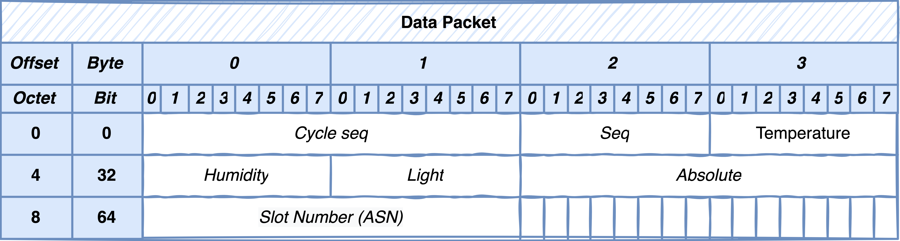
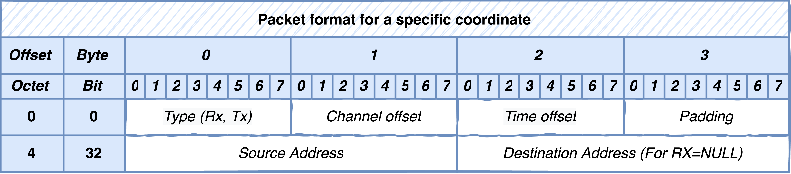

.. _data_plane:

===========
Data plane
===========

The data plane in its core uses Contiki-NG_ OS. However, we have modified it to support new functionalities. \
The new version named Contiki-NG-SDWSN_, which started as a fork of the Contiki-NG_ and retains some of its original features, is an SDN-based solution for WSNs. It focuses in making the sensor network reprogrammable.

Functionalities and packet formats
----------------------------------

Contiki-NG-SDWSN_ provides the following functionalities:

* Data packets: This packet encapsulates the collected data and sends them to the control plane. The packet format is shown below.

|data_packet|

==========  ==============================================  
Parameter   Value   
==========  ============================================== 
Cycle seq.  Cycle sequence use in RL.  
Seq.        Sequence within a cycle seq.  
ASN         Absolute slot number for latency calculations.  
==========  ==============================================

* Neighbor discovery (ND): This type of packet discovers other sensor devices in the sender transmission range. It also allows discovering neighbors with paths to the controller. This packet contains three fields: rank, Received Signal Strength Indicator (RSSI), and checksum. The RSSI field specifies the accumulative RSSI to the controller. This field permits the receiver node to decide which parent to choose between two equal rank values. Lastly, the checksum field is an error checking of the packet integrity.

* Neighbor advertisement (NA): This packet contains messages to report sensor status and neighbors' to the controller, including the average power consumption, rank, and links to neighbors. The format of the packet header is shown below.

|na_packet|

==============  ==============================================  
Parameter        Value   
==============  ============================================== 
Payload length  Payload size in bytes.  
Sender rank     Rank of the sender.
Sender power    Average power consumption.
Cycle seq.      Cycle sequence use in RL. 
Seq.            Sequence within a cycle seq.
CRC             Cyclic Redundancy Check.
==============  ==============================================

* Network configuration - TSCH schedules: This packet type is a control message to establish the TSCH schedules for the incoming cycle. The header has four fields: payload length, slotframe size, sequence, and CRC. The slotframe size field contains the length of the schedules encapsulated in the payload. The packet format of the payload is shown below.

|tsch_packet|

===================  ==============================================  
Parameter            Value   
===================  ============================================== 
Type (Rx, TX)        Type of the embedded TSCH link: Rx, Tx.
Channel & Time off.  Coordinates of the given link.
Source Address       Address of the sensor node that needs to process this link.
Destination Address  Used in Tx link types to set the neighbor address.
===================  ==============================================

* Network configuration - Routes: This packet type is also a control message to establish the forwarding paths for the incoming cycle. The packet header consists of payload length, sequence, and CRC fields which fulfill the same function mentioned above. The packet payload contains the source, destination, and neighbor addresses to build the forwarding paths.

Source code
-----------

Changes made to the original Contiki-NG_ repository are outlined below.

#. The SDWSN protocol stack resides in the folder ``contiki-ng/os/net/sdn-net``.

#. The communication between the sink and the controller is established through a serial interface which is located in the folder ``contiki-ng/os/services/sdn-controller-serial``.

#. ELISE adopts concepts from Orchestra_. The changes made to Orchestra are found in ``contiki-ng/os/services/orchestra-sdn-centralised``.

#. Sensor nodes estimate the average power consumption using the ``sdn-power-measurement`` service which can be found in ``contiki-ng/os/services/sdn-power-measurement``.

.. _Contiki-NG: https://github.com/contiki-ng/contiki-ng
.. _Contiki-NG-SDWSN: https://github.com/fdojurado/contiki-ng
.. _SDWSN-Controller: https://github.com/fdojurado/SDWSN-controller

.. |na_packet| image:: ../images/na-packet.png
   :width: 600
   :align: middle
   :alt: Data packet format

.. _Orchestra: https://github.com/contiki-ng/contiki-ng/wiki/Documentation:-Orchestra