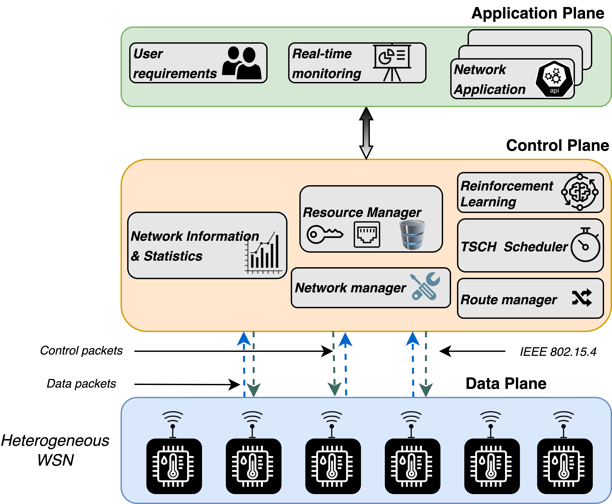

.. ELISE documentation master file, created by
   sphinx-quickstart on Fri Sep 30 10:04:27 2022.
   You can adapt this file completely to your liking, but it should at least
   contain the root `toctree` directive.

Welcome to ELISE's documentation!
=================================

ELISE is a framework built upon multidisciplinary research efforts of Software-Defined Networking (SDN), Wireless Sensor Networks (WSNs), and Machine Learning (ML). The aim of ELISE is to provide a holistic architecture to support run-time network reconfigurations and deployment of  ML algorithms in WSNs. \
We currently support reinforcement learning to adapt the slotframe size of the TSCH protocol give a set of user requirements. A detail description of the project can be found in the paper.

A overview of the framework is shown below:

|sdwsn_architecture|

The ELISE project comprises two main components or repositories: data plane , control plane.

* Data plane: devices that reside on this plane runs on an embedded operating systems. Among the embedded operating systems available in the market, ELISE use Contiki-NG_. However, to comply with SDWSN principles of making the network infrastructure run simple tasks and remove energy-intensive functions from sensor nodes, we have redesigned the protocol stack. Thus, we have added support to these functionalities in Contiki-NG-SDWSN_.

* Control plane: In its core, it runs on Python_. This plane provides support to all functionalities listed in the architecture including reinforcement learning, the code resides in SDWSN-Controller_.

ELISE repository has all components added as submodules, and it also has scripts to automate experiments in the FIT-IoT-LAB_ platform.

Contents
=========
.. toctree::
   :maxdepth: 2

   ELISE Home <self>
   installation/installation
   getting_started/getting_started
   tutorials/tutorials

Citing ELISE
============

If you wish to cite ELISE in your academic work, you can add this:

.. code-block:: bibtex

   @article{ELISE,
   title={ELISE: A Reinforcement Learning Framework to Optimize the Sloftframe Size of the TSCH Protocol in IoT Networks},
   author={Jurado Lasso, Fabian Fernando and Barzegaran, Mohammadreza and Jurado, Jesus Fabian and Fafoutis, Xenofon},
   year={2023},
   publisher={TechRxiv},
   doi={10.36227/techrxiv.23212442.v2}
   }

.. Indices and tables
.. ==================

.. * :ref:`genindex`
.. * :ref:`modindex`
.. * :ref:`search`

.. _Contiki-NG: https://github.com/contiki-ng/contiki-ng
.. _Contiki-NG-SDWSN: https://github.com/fdojurado/contiki-ng
.. _Python: https://www.python.org/
.. _SDWSN-Controller: https://github.com/fdojurado/SDWSN-controller
.. _FIT-IoT-LAB: https://www.iot-lab.info/
